# Olist Store Analysis

## Welcome To The Olist Store
Along with the rapid growth of the E-commerce business around the world, it made me curious to did an analysis project of an E-commerce from Brazil, called Olist. To analyze and derive insights to answer crucial questions and help the store make data driven decisions.

## Dataset

-	Project Name: Olist Store Analysis
- Dataset Name: Total 9 files
- Dataset Type: CSV Data
- Dataset Zip Folder Size: 45 MB

## Problem Statement
 -	Weekday Vs Weekend (order_purchase_timestamp) Payment Statistics
 - 	Number of Orders with review score 5 and payment type as credit card
 -  Average number of days taken for order_delivered_customer_date for pet shop
 -  Average price and payment values from customers of Sao Paulo city
 -  Relationship between shipping days (order_delivered_customer_date - order_purchase_timestamp) Vs review scores

## Skills/ Concepts Demonstrated
- The following skills were incorporated:
   - Excel (pivot tables, charts, conditional formatting, VBA Macros, Slicers, Power Pivot)
   - MySQL (Joins, Group by, Having, Window Functions, View, Aggregate Functions)
   - Power BI (Bookmarking, DAX, Quick Measures, Page Navigations, Modelling, Filters, Tooltips)
   - Tableau (Joins, Custom Charts, Calculated Field, parameters, actions, filters, buttons, annotations)
 
## Modelling
Adjusted data model According To Data Schema. Dimension tables are joined to the fact table with one to many relationship

 Adjusted Model                                                                                                  |                                                  Data schema
:---------------------------------------------------------------------------------------------------------------:|:-------------------------------------------:
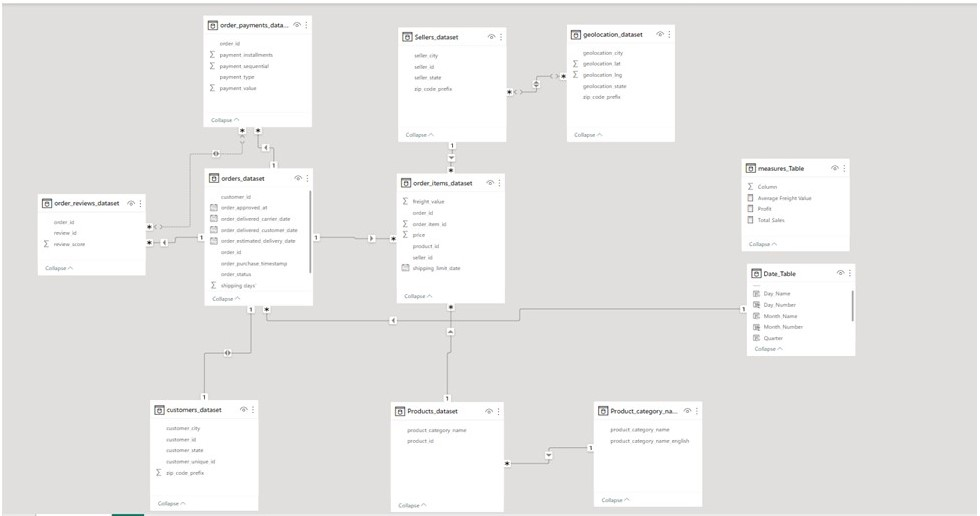                                                                             |   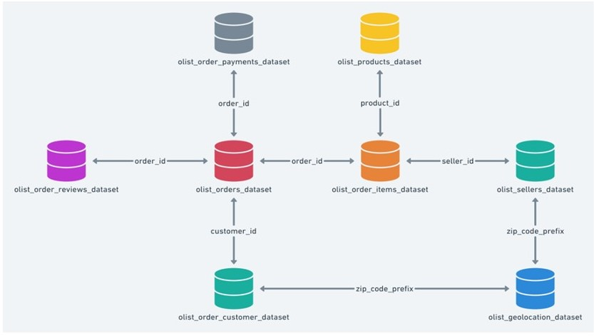
   
## Analysis & visualizations
The Report Comprises 3 Dashboards:

  1. Excel Dashboard
     
   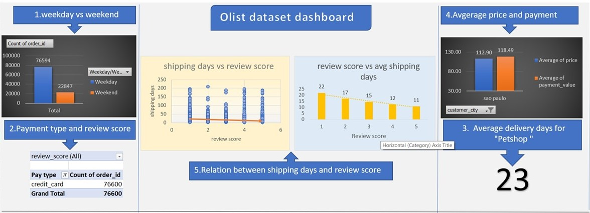

  2. Tableau Dashboard

      Dashboard 1
   
   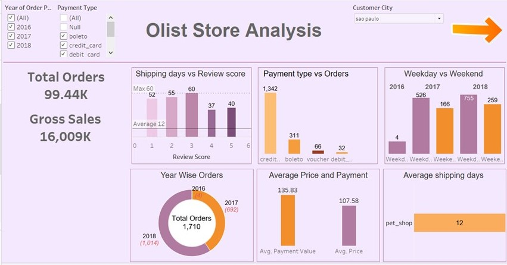

     Dashboard 2

     
   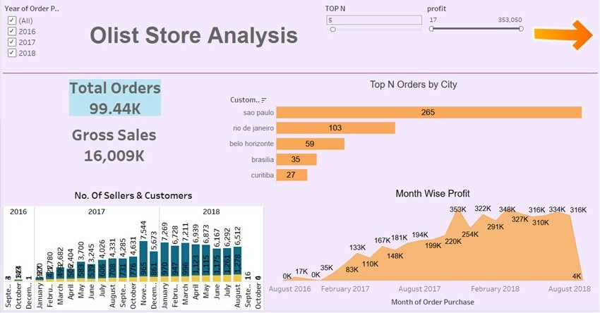
     

  3. PowerBi Dashboards
     
     Dashboard 1
     
     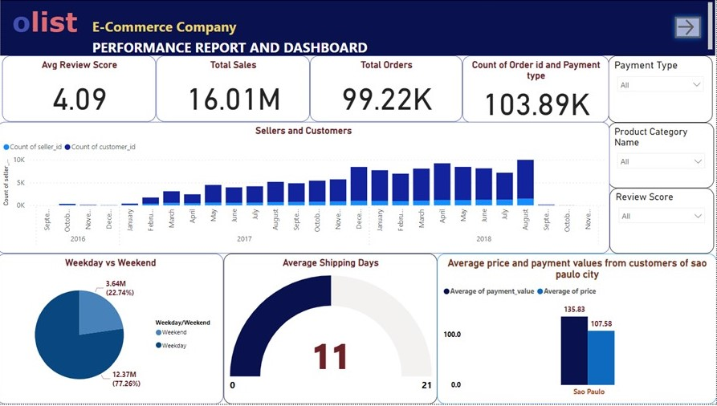
     
     Dashboard 2
     
     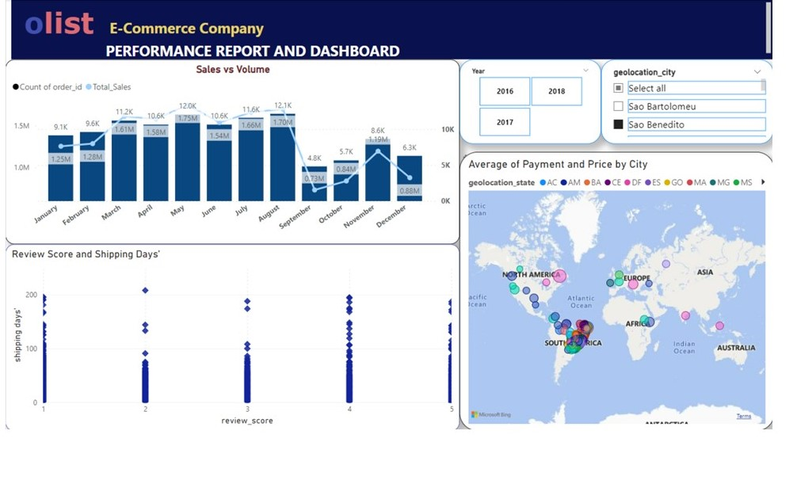
     
  You Can Interact With The Report Here [Here]([https://app.powerbi.com/groups/me/reports/0d0c765f-3253-43a4-9378-279277832743/ReportSectionf9e789b04bce22d87367?experience=power-bi](https://app.powerbi.com/groups/me/reports/cccdd1eb-7bf2-4ab4-a385-c6653a874be3?experience=power-bi)https://app.powerbi.com/groups/me/reports/cccdd1eb-7bf2-4ab4-a385-c6653a874be3?experience=power-bi)

 4. Mysql File

## Overview and features

1. Mostly Used payment Modes

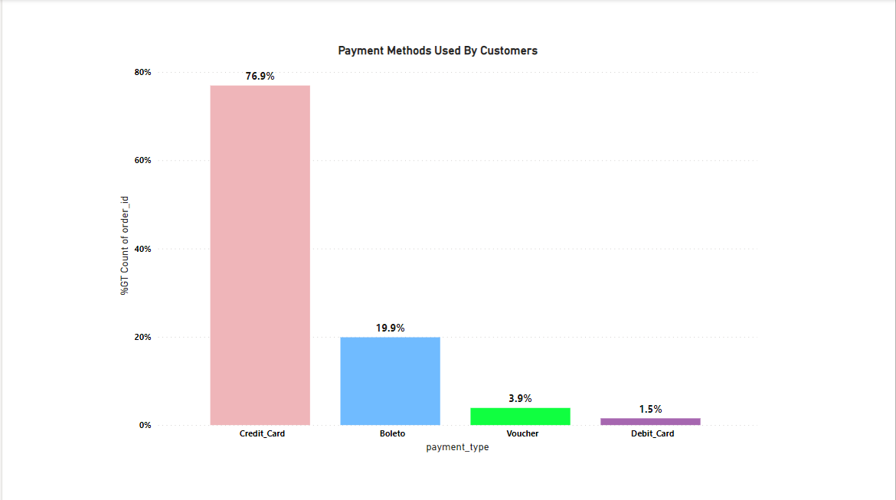

 -It is reported that total four type of payment methods are used by customers. Credit card, boleto, voucher and Debit Card. Out of all orders,  76.9% of orders have reported credit card as payment mode & 20% of orders reported boleto as a payment mode which contribute 95% of total payment records.

   
2. Sellers Per Product Category
   
   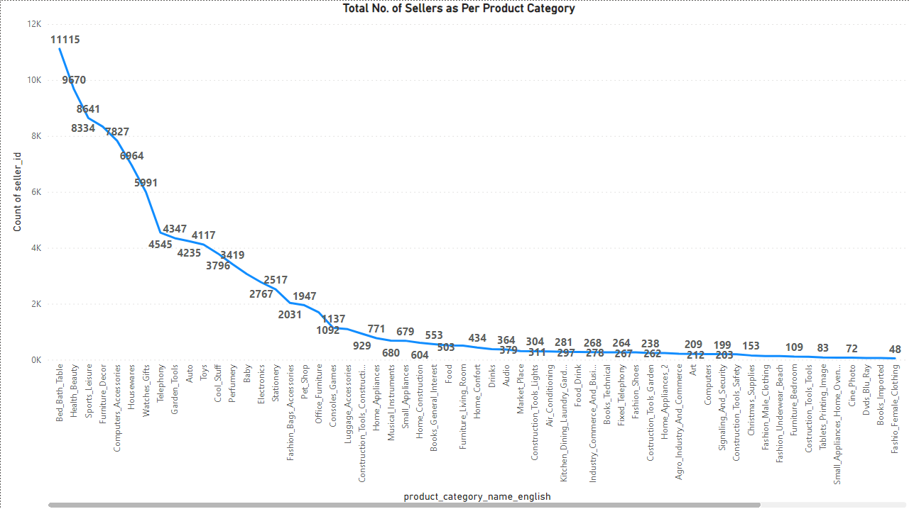
   
  -The most Common Product Sellers listed on olist for Bed Bath Table , Health Beauty, Sports Leisure, Furniture Decor etc.. we found that most of the sellers prefer to sell the products with High User Reviews and Costing to ensure bulk order and high Profit Margins. At same time office furniture are very less leading to high profit and margins.
 
   
3. Freight Cost Analysis
   
   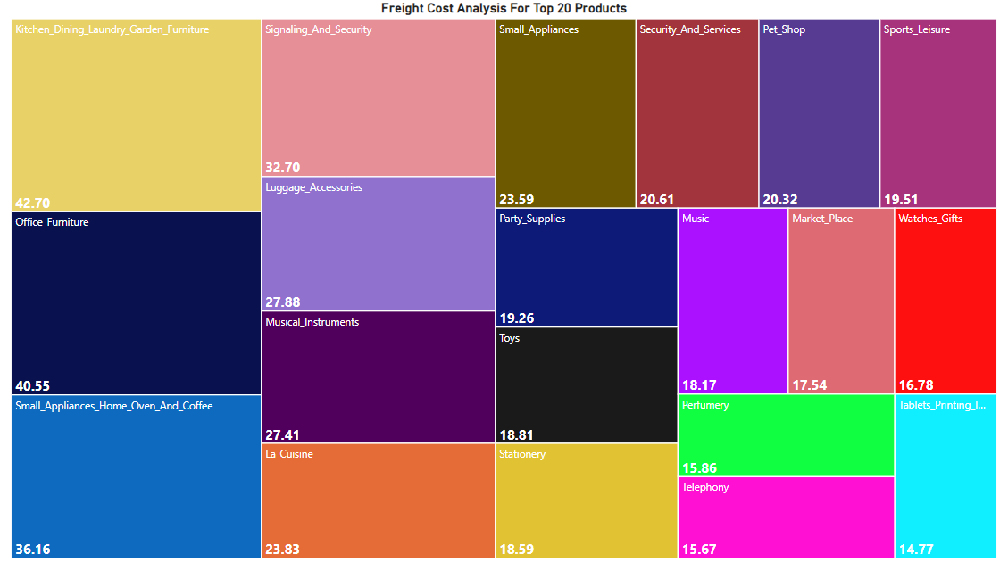

  -We see here that freight value ranges from 14.77 for Tablets Printing Image to 42.70 for kitchen dining laundry garden furniture. Usually kitchen Dining has more than the double the cost of tablets printing image.

   
4. Top 20 Cities Highest Sellers
   
   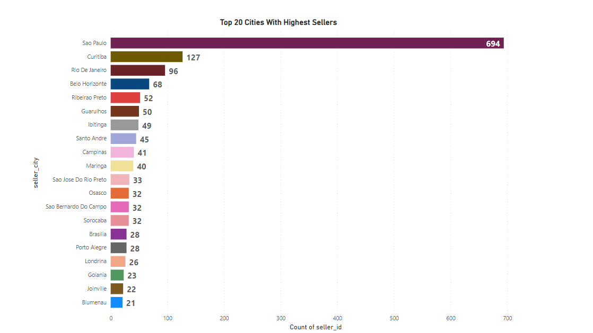
   
  - Sao Paulo has the most of the sellers across the market. Around 694 Sellers are there in Sao Paulo , 127 sellers in Curitiba And 96 sellers in Rio de Janeiro and so on.

## Conclusion 

- We can conclude that olist should use credit card promotional schemes to increase orders in upcoming years.
- we can Assume  that the quality of the product delivered  is compensating  for the above.
- So here we can conclude  that bigger the size of the product higher the freight cost for delivery.
- we can conclude that Sao Paulo as a prime market which contributes in majority of revenue as well as count of sellers.
  
## Recommendations
- focus on faster delivery.
- easy payment modes
- product-specific offers
  

# Recommendation: To better understand the Olist E-commerce market environment, we will need a longer period of datasets.

